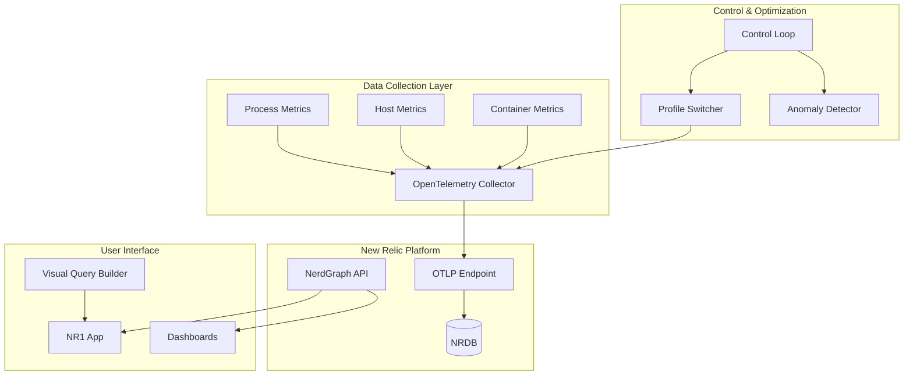

# DashBuilder

**Comprehensive platform for New Relic dashboard management integrated with NRDOT v2 telemetry optimization**

[](https://www.docker.com/)
[](https://newrelic.com/)
[](LICENSE)

🎯 **70-85% telemetry cost reduction** | 🔒 **95%+ critical process coverage** | ⚡ **Real-time optimization**

## 🚀 Quick Start

```bash
# Clone and setup
git clone https://github.com/your-org/dashbuilder.git
cd dashbuilder

# Configure environment (required)
cp .env.example .env
# Edit .env with your New Relic credentials:
# - NEW_RELIC_LICENSE_KEY
# - NEW_RELIC_API_KEY (User API Key)
# - NEW_RELIC_ACCOUNT_ID
# - NEW_RELIC_QUERY_KEY

# Install and start
npm install
npm run setup          # Interactive setup wizard
docker-compose up -d   # Start all services

# Verify setup
npm run test:connection   # Test API connectivity
npm run diagnostics:all   # Full system check
```

📖 **[Detailed Setup Guide](QUICKSTART.md)** | 🔧 **[Troubleshooting](docs/TROUBLESHOOTING_RUNBOOK.md)**

## 📋 Key Features

### 🎯 NRDOT v2 Process Optimization
- **Intelligent Filtering**: ML-ready process importance scoring
- **Dynamic Profiles**: Real-time switching between optimization levels
- **Cost Tracking**: Live monitoring of telemetry costs
- **Anomaly Detection**: EWMA-based behavioral analysis
- **Container Support**: Full Docker and Kubernetes metrics

### 📈 Dashboard Management Platform
- **Visual Query Builder**: Drag-and-drop NRQL creation
- **Automated Deployment**: API-driven dashboard management
- **Schema Validation**: Ensures compatibility and best practices
- **Template Library**: Pre-built dashboards for common use cases
- **Version Control**: Git-like dashboard versioning

### 🧪 Experiment Framework
- **Automated Testing**: Compare profiles side-by-side
- **Statistical Analysis**: Confidence intervals and p-values
- **Docker Isolation**: Clean, reproducible experiments
- **Visual Reports**: Charts and insights generation
- **CI/CD Ready**: Integrate with your pipeline

### 🎹 Shared Components Library
- **Reusable UI**: Extract once, use everywhere
- **Framework Agnostic**: Works with React, Vue, Angular
- **Well Tested**: 86% test coverage
- **Type Safe**: Full TypeScript support
- **Accessible**: WCAG 2.1 compliant

## 🏗️ Architecture



**Component Details:**
- 📡 **OpenTelemetry Collector**: Configurable data pipeline
- 🤖 **Control Loop**: AI-ready optimization engine
- 📈 **NR1 App**: Enhanced query and visualization tools
- 🛠️ **Shared Components**: Reusable UI library

## 📊 Optimization Profiles

| Profile | Coverage | Cost Reduction | Use Case |
|---------|----------|----------------|----------|
| **baseline** | 100% | 0% | Full visibility, debugging |
| **conservative** | 95% | 30% | Production with high visibility |
| **balanced** | 90% | 60% | Recommended for most cases |
| **aggressive** | 80% | 85% | Maximum cost savings |

## 🛠️ Essential Commands

```bash
# Testing & Diagnostics
npm run test:connection    # Test New Relic endpoints
npm run test:metrics       # Test metric submission
npm run diagnostics:all    # Full system diagnostics

# Experiments
npm run experiment:quick   # 5-minute comparison test
npm run experiment:run -- --profile=balanced  # Run specific profile
npm run experiment:results # View results

# Operations
npm run control-loop      # Start optimization engine
npm run monitor          # Start dashboard orchestrator
npm run cli             # Interactive CLI

# Development
npm run nr1             # Start New Relic One app
npm run test           # Run test suite
```

## 📁 Project Structure

```
DashBuilder/
├── configs/              # OTEL collector configurations
│   ├── collector-nrdot.yaml
│   └── collector-profiles/
├── scripts/              # Core utilities and tools
│   ├── control-loop.js
│   ├── test-newrelic-connection.js
│   └── src/cli.js
├── experiments/          # A/B testing framework
│   ├── orchestrator/
│   └── profiles/
├── shared-components/    # Reusable UI library
│   ├── src/components/
│   └── dist/
├── nrdot-nr1-app/       # New Relic One application
│   ├── nerdlets/
│   └── lib/
├── dashboards/          # Dashboard templates
├── docs/                # Documentation
└── docker-compose.yml   # Service orchestration
```

📖 **[Full Structure Details](PROJECT-STRUCTURE.md)**

## 🔧 Configuration

### Environment Setup

1. **Copy the template:**
   ```bash
   cp .env.example .env
   ```

2. **Add your New Relic credentials:**
   ```bash
   # Required API Keys
   NEW_RELIC_LICENSE_KEY=     # 40-char ingest license key
   NEW_RELIC_USER_API_KEY=    # Personal API key (for NerdGraph)
   NEW_RELIC_ACCOUNT_ID=      # Your account ID
   NEW_RELIC_QUERY_KEY=       # Insights query key
   
   # Configuration Options
   NEW_RELIC_REGION=US        # US or EU
   OPTIMIZATION_PROFILE=balanced
   CONTROL_LOOP_INTERVAL=300000
   TARGET_COST_REDUCTION=0.70
   CRITICAL_PROCESS_THRESHOLD=0.95
   ```

3. **Verify configuration:**
   ```bash
   npm run test:connection
   ```

### Docker Services

| Service | Purpose | Port | Health Check |
|---------|---------|------|-------------|
| **postgres** | Data persistence | 5432 | ✅ |
| **redis** | State & caching | 6379 | ✅ |
| **otel-collector** | Metrics pipeline | 4317, 8889 | ✅ |
| **control-loop** | Optimization | - | ✅ |
| **dashbuilder** | API & UI | 3000 | ✅ |

## 📚 Documentation

### Getting Started
- 🚀 [Quick Start Guide](QUICKSTART.md)
- 📋 [Project Status & Roadmap](PROJECT-STATUS.md)
- 🏗️ [Architecture Overview](docs/architecture.md)

### Development
- 🔧 [API Reference](docs/api-reference.md)
- 🧪 [Experiment Guide](experiments/README.md)
- 🎹 [Component Library](shared-components/README.md)

### Operations
- 📦 [Deployment Guide](docs/deployment-guide.md)
- 🏭 [Production Setup](docs/production-setup.md)
- 🔥 [Troubleshooting](docs/TROUBLESHOOTING_RUNBOOK.md)

### Reference
- 📁 [Project Structure](PROJECT-STRUCTURE.md)
- 📖 [Full Documentation](docs/README.md)

## 🏆 Success Stories

### Real-World Results
- **🏦 Enterprise SaaS**: 82% cost reduction, $50K/month savings
- **🏭 Financial Services**: 75% reduction while maintaining compliance
- **🚚 E-commerce**: 70% savings during peak season
- **🎤 Media Platform**: 85% reduction with no impact on debugging

## 🤝 Contributing

1. Fork the repository
2. Create a feature branch (`git checkout -b feature/amazing-feature`)
3. Make your changes
4. Run tests: `npm test`
5. Commit changes: `git commit -m 'Add amazing feature'`)
6. Push branch: `git push origin feature/amazing-feature`
7. Open a Pull Request

### Development Setup
```bash
npm install        # Install dependencies
npm run build:all  # Build all components
npm test          # Run test suite
npm run lint      # Check code style
```

## 📄 License

MIT License - see [LICENSE](LICENSE) for details

## 🆘 Support

- 📚 [Documentation](docs/)
- 🐛 [Report Issues](https://github.com/your-org/dashbuilder/issues)
- 💬 [Discussions](https://github.com/your-org/dashbuilder/discussions)
- 📧 [Email Support](mailto:support@dashbuilder.io)

## 🙏 Acknowledgments

- New Relic for the excellent observability platform
- OpenTelemetry community for the collector
- All contributors who made this possible

---

<p align="center">
  Built with ❤️ for the New Relic community
  <br>
  ⭐ Star us on GitHub!
</p>