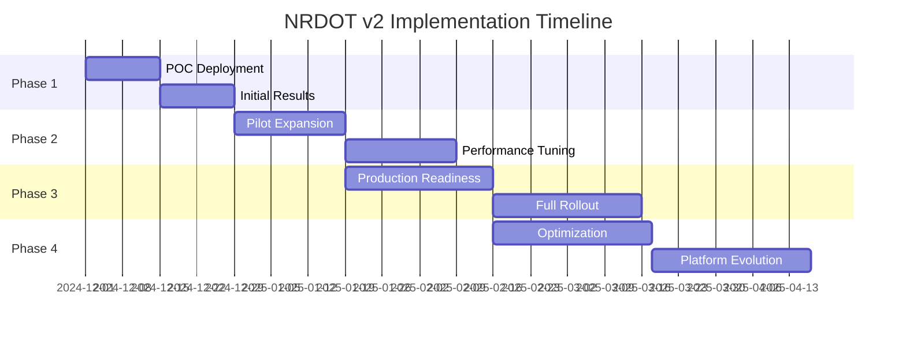
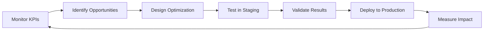

# NRDOT v2 Implementation Roadmap: From POC to Production

## 🎯 Strategic Implementation Path

This roadmap provides a practical, milestone-based approach to implementing NRDOT v2 in production environments, with clear success criteria and risk mitigation strategies.

---

## 📅 Timeline Overview



---

## 🔬 Month 1: Proof of Concept

### Week 1-2: Environment Setup & Baseline
```yaml
objectives:
  - Deploy NRDOT v2 on 5-10 development hosts
  - Establish baseline metrics
  - Validate basic functionality
  
tasks:
  infrastructure:
    - [ ] Provision test environment
    - [ ] Install NRDOT-Plus distribution
    - [ ] Configure monitoring dashboards
    - [ ] Set up alerting
  
  baseline_collection:
    - [ ] Document current process metrics volume
    - [ ] Calculate current monthly costs
    - [ ] Identify critical processes
    - [ ] Map process dependencies
  
success_criteria:
  - Successful deployment on all test hosts
  - Baseline metrics collected for 7 days
  - No impact on existing monitoring
  - Cost calculation accuracy validated
```

### Week 3-4: Initial Optimization
```bash
#!/bin/bash
# POC optimization script
echo "=== NRDOT POC Optimization Phase ==="

# Start with conservative profile
nrdot-plus-ctl profile set conservative

# Monitor for 48 hours
sleep 172800

# Analyze results
nrdot-plus-ctl metrics json > poc-metrics-conservative.json

# Switch to balanced
nrdot-plus-ctl profile set balanced

# Monitor and compare
sleep 172800
nrdot-plus-ctl metrics json > poc-metrics-balanced.json

# Generate POC report
./generate-poc-report.sh
```

### POC Success Metrics
```yaml
minimum_requirements:
  cost_reduction: ">= 50%"
  critical_coverage: "100%"
  cpu_overhead: "< 3%"
  memory_overhead: "< 100MB"
  false_positives: "< 5%"
  
decision_gates:
  proceed_to_pilot:
    - All minimum requirements met
    - No critical issues identified
    - Stakeholder approval received
    - Rollback plan tested
```

---

## 🚀 Month 2: Pilot Program

### Week 5-6: Controlled Expansion
```yaml
pilot_scope:
  environments:
    - 20% of production hosts
    - All staging environments
    - Select customer-facing services
  
  deployment_strategy:
    - Blue-green deployment per service
    - Canary rollout by host groups
    - Real-time rollback capability
  
  monitoring_enhancement:
    - A/B comparison dashboards
    - Cost tracking per service
    - Coverage validation automation
    - Incident correlation analysis
```

### Week 7-8: Advanced Configuration
```yaml
advanced_features:
  custom_classifications:
    - Business-critical service patterns
    - Compliance-required processes
    - Customer-specific requirements
  
  time_based_optimization:
    business_hours:
      profile: "balanced"
      schedule: "Mon-Fri 08:00-18:00"
    
    after_hours:
      profile: "aggressive"
      schedule: "Mon-Fri 18:00-08:00"
    
    weekends:
      profile: "aggressive"
      schedule: "Sat-Sun"
  
  alert_integration:
    - PagerDuty integration
    - Slack notifications
    - Email reports
    - Webhook automation
```

### Pilot Validation Framework
```python
# Pilot validation script
import pandas as pd
from datetime import datetime, timedelta

class PilotValidator:
    def __init__(self):
        self.metrics = {
            'cost_reduction': [],
            'coverage_scores': [],
            'incident_detection': [],
            'performance_impact': []
        }
    
    def validate_pilot_success(self):
        results = {
            'cost_savings': self.calculate_savings(),
            'coverage_maintained': self.check_coverage(),
            'incidents_detected': self.validate_incidents(),
            'performance_acceptable': self.check_performance(),
            'user_satisfaction': self.survey_results()
        }
        
        return all(results.values())
    
    def generate_executive_report(self):
        # Generate comprehensive pilot report
        # Include ROI calculations
        # Risk assessment
        # Recommendation for full rollout
        pass
```

---

## 🏭 Month 3: Production Rollout

### Week 9-10: Production Preparation
```yaml
pre_production_checklist:
  technical_readiness:
    - [ ] Load testing completed (10x current volume)
    - [ ] Disaster recovery tested
    - [ ] Security audit passed
    - [ ] Performance benchmarks met
  
  operational_readiness:
    - [ ] Runbooks created and tested
    - [ ] Team training completed
    - [ ] Escalation procedures defined
    - [ ] Change management approved
  
  business_alignment:
    - [ ] Cost-benefit analysis approved
    - [ ] SLA impact assessed
    - [ ] Compliance requirements verified
    - [ ] Executive sign-off received
```

### Week 11-12: Phased Production Rollout
```bash
#!/bin/bash
# Production rollout automation

# Phase 1: Low-risk services (25%)
deploy_phase "phase1" "low-risk" "conservative"
monitor_phase "phase1" "24h"
validate_phase "phase1"

# Phase 2: Medium-risk services (50%)
deploy_phase "phase2" "medium-risk" "balanced"
monitor_phase "phase2" "48h"
validate_phase "phase2"

# Phase 3: High-risk services (25%)
deploy_phase "phase3" "high-risk" "conservative"
monitor_phase "phase3" "72h"
validate_phase "phase3"

# Phase 4: Enable control loops
enable_control_loops "all"
monitor_phase "control-loops" "168h"

echo "Production rollout complete!"
```

### Production Monitoring
```yaml
monitoring_strategy:
  real_time_dashboards:
    - Service-level cost tracking
    - Coverage heat maps
    - Optimization effectiveness
    - Anomaly detection rates
  
  automated_reports:
    daily:
      - Cost savings summary
      - Coverage violations
      - Performance metrics
    
    weekly:
      - Trend analysis
      - Optimization recommendations
      - Capacity planning
    
    monthly:
      - Executive summary
      - ROI analysis
      - Strategic recommendations
```

---

## 🔄 Month 4+: Continuous Optimization

### Optimization Cycles
```yaml
weekly_optimization:
  monday:
    - Review weekend performance
    - Adjust profiles if needed
    - Plan week's optimizations
  
  wednesday:
    - Mid-week checkpoint
    - A/B test results review
    - Fine-tune configurations
  
  friday:
    - Week summary
    - Prepare weekend settings
    - Document learnings

monthly_optimization:
  week_1:
    - Deep dive analysis
    - Pattern identification
    - Model retraining
  
  week_2:
    - Test new optimizations
    - Validate improvements
    - Risk assessment
  
  week_3:
    - Deploy improvements
    - Monitor impact
    - Gather feedback
  
  week_4:
    - Monthly review
    - Strategic planning
    - Report generation
```

### Advanced Optimization Techniques
```python
class AdvancedOptimizer:
    def __init__(self):
        self.ml_models = self.load_models()
        self.historical_data = self.load_history()
    
    def optimize_by_workload(self):
        """
        Dynamic optimization based on workload patterns
        """
        workload_patterns = {
            'batch_processing': {
                'schedule': '02:00-06:00',
                'profile': 'minimal',
                'reason': 'Non-interactive workload'
            },
            'peak_traffic': {
                'schedule': '09:00-11:00,14:00-16:00',
                'profile': 'conservative',
                'reason': 'High user activity'
            },
            'maintenance_window': {
                'schedule': 'Sun 02:00-06:00',
                'profile': 'aggressive',
                'reason': 'Planned downtime'
            }
        }
        return self.apply_patterns(workload_patterns)
    
    def predictive_optimization(self):
        """
        ML-based predictive optimization
        """
        # Predict next week's optimal settings
        predictions = self.ml_models['prophet'].predict(
            self.historical_data,
            periods=7*24*60  # 7 days in minutes
        )
        
        return self.generate_optimization_plan(predictions)
```

---

## 📊 Success Measurement Framework

### Key Performance Indicators
```yaml
technical_kpis:
  availability:
    target: "99.99%"
    measurement: "Uptime monitoring"
    alert_threshold: "99.95%"
  
  performance:
    cpu_overhead:
      target: "< 2%"
      measurement: "Host CPU metrics"
    
    memory_overhead:
      target: "< 100MB"
      measurement: "Process memory usage"
    
    latency_impact:
      target: "< 1ms"
      measurement: "Application response time"

business_kpis:
  cost_reduction:
    target: "70-85%"
    measurement: "Monthly billing analysis"
    minimum_acceptable: "60%"
  
  coverage:
    critical_processes:
      target: "100%"
      measurement: "Process inventory audit"
    
    overall_visibility:
      target: "> 95%"
      measurement: "Incident detection rate"
  
  roi:
    payback_period:
      target: "< 3 months"
      measurement: "Cost savings vs implementation cost"
    
    annual_savings:
      target: "> $1M"
      measurement: "Year-over-year comparison"
```

### Continuous Improvement Process


---

## 🛡️ Risk Management

### Risk Matrix
```yaml
risks:
  high_impact_high_probability:
    - description: "Missing critical process during incident"
      mitigation: "100% coverage for Tier 1 processes"
      contingency: "Emergency profile activation"
    
  high_impact_low_probability:
    - description: "Complete optimization failure"
      mitigation: "Automated rollback capability"
      contingency: "Manual override procedures"
    
  low_impact_high_probability:
    - description: "Minor coverage gaps"
      mitigation: "Regular audit processes"
      contingency: "Quick configuration updates"
    
  low_impact_low_probability:
    - description: "Performance degradation"
      mitigation: "Resource limits and monitoring"
      contingency: "Scale infrastructure"
```

### Rollback Procedures
```bash
#!/bin/bash
# Emergency rollback procedure

emergency_rollback() {
    echo "🚨 EMERGENCY ROLLBACK INITIATED 🚨"
    
    # 1. Disable control loops
    systemctl stop nrdot-plus-control-loop
    
    # 2. Set conservative profile
    nrdot-plus-ctl profile set conservative
    
    # 3. Notify stakeholders
    send_alert "NRDOT Emergency Rollback Executed"
    
    # 4. Preserve state for analysis
    tar -czf /tmp/nrdot-emergency-$(date +%s).tar.gz \
        /var/lib/nrdot-plus/state \
        /var/log/nrdot-plus
    
    # 5. Await manual intervention
    echo "Rollback complete. Manual review required."
}
```

---

## 🎓 Team Enablement

### Training Program
```yaml
week_1_fundamentals:
  day_1:
    - NRDOT architecture overview
    - Process classification concepts
    - Profile management basics
  
  day_2:
    - Hands-on deployment lab
    - Configuration exercises
    - Troubleshooting basics
  
  day_3:
    - Monitoring and alerting
    - Cost analysis tools
    - Report generation
  
  day_4:
    - Advanced configurations
    - Custom classifications
    - Time-based rules
  
  day_5:
    - Incident response procedures
    - Rollback processes
    - Q&A and certification

week_2_advanced:
  - ML model customization
  - Performance tuning
  - Integration development
  - Architecture deep dive
```

### Documentation Requirements
1. **Operational Runbooks**: Step-by-step procedures
2. **Architecture Diagrams**: Current and future state
3. **API Documentation**: For all integrations
4. **Troubleshooting Guide**: Common issues and solutions
5. **Best Practices**: Learned from implementation

---

## 📈 Expected Outcomes

### By End of Month 1:
- ✅ POC validates 70%+ cost reduction
- ✅ No impact on critical monitoring
- ✅ Team trained and confident

### By End of Month 2:
- ✅ Pilot proves production readiness
- ✅ Custom optimizations developed
- ✅ Stakeholder buy-in achieved

### By End of Month 3:
- ✅ Full production deployment
- ✅ Automated optimization active
- ✅ Significant cost savings realized

### By End of Month 6:
- ✅ Mature optimization platform
- ✅ ML-driven improvements
- ✅ Platform for future innovations

---

*"Success is not just about reducing costs - it's about creating a sustainable, intelligent observability practice that scales with your business."*