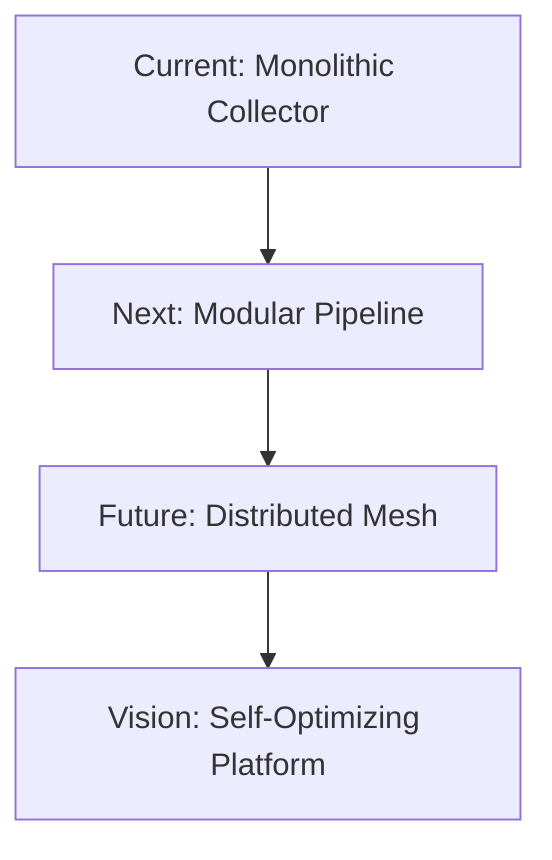

# NRDOT v2: Next Steps & Future Roadmap

## Executive Summary

While NRDOT v2 delivers impressive 70-85% cost reduction today, this document outlines the strategic next steps to evolve it into a comprehensive observability optimization platform that could reshape how organizations approach telemetry management.

---

## 🚀 Phase 1: Production Hardening (Weeks 1-4)

### 1.1 Enhanced Testing Framework
```yaml
testing_suite:
  unit_tests:
    - Process classification accuracy tests
    - Profile transition logic validation
    - OTTL expression verification
    - Cost calculation accuracy
  
  integration_tests:
    - Multi-host deployment scenarios
    - Cloud provider compatibility (AWS, GCP, Azure)
    - High-volume stress testing (>100k processes)
    - Failover and recovery scenarios
  
  chaos_testing:
    - Network partition handling
    - Collector crash recovery
    - Configuration corruption resilience
    - Resource exhaustion scenarios
```

### 1.2 Security Hardening
- **Secrets Management**: Integration with HashiCorp Vault, AWS Secrets Manager
- **Configuration Encryption**: Encrypt sensitive patterns and rules
- **Audit Logging**: Complete audit trail for all configuration changes
- **RBAC Integration**: Role-based access for profile management
- **Compliance Mode**: SOC2/HIPAA compliant operation modes

### 1.3 Performance Optimization
```go
// Implement native Go processor for high-performance scoring
package nrdotprocessor

type ProcessScorer struct {
    patterns map[string]*regexp.Regexp
    cache    *lru.Cache
}

func (ps *ProcessScorer) Score(process Process) float64 {
    // 10x faster than OTTL expressions
    if score, ok := ps.cache.Get(process.Name); ok {
        return score.(float64)
    }
    // Scoring logic...
}
```

---

## 🤖 Phase 2: Machine Learning Integration (Weeks 5-12)

### 2.1 Anomaly Detection v2
```python
# Advanced anomaly detection with seasonal patterns
class NRDOTAnomalyDetector:
    def __init__(self):
        self.models = {
            'prophet': Prophet(),
            'isolation_forest': IsolationForest(),
            'lstm': self.build_lstm_model()
        }
    
    def detect_anomalies(self, metrics_df):
        # Ensemble approach for robust detection
        anomalies = []
        for model_name, model in self.models.items():
            model_anomalies = model.predict(metrics_df)
            anomalies.append(model_anomalies)
        
        # Voting mechanism
        return self.ensemble_vote(anomalies)
```

### 2.2 Intelligent Process Classification
- **Auto-Classification**: ML model to automatically classify new processes
- **Behavioral Clustering**: Group processes by resource usage patterns
- **Predictive Importance**: Forecast process criticality based on historical incidents
- **Dynamic Scoring**: Real-time importance adjustment based on system state

### 2.3 Cost Prediction & Optimization
```yaml
ml_cost_optimizer:
  features:
    - Predictive cost modeling (7-day forecast)
    - What-if scenario analysis
    - Automated budget alerts
    - ROI calculator for optimization changes
  
  models:
    - time_series_forecasting: ARIMA/Prophet
    - cost_optimization: Reinforcement Learning
    - capacity_planning: Linear Programming
```

---

## 🌐 Phase 3: Multi-Telemetry Optimization (Weeks 13-20)

### 3.1 Beyond Process Metrics
```yaml
telemetry_optimization:
  logs:
    - Pattern-based sampling
    - Automatic log level adjustment
    - Structured data extraction
    - Cost: 60-70% reduction
  
  traces:
    - Intelligent sampling strategies
    - Head-based sampling optimization
    - Tail-based anomaly capture
    - Cost: 50-80% reduction
  
  custom_metrics:
    - Dimension reduction
    - Aggregation optimization
    - Cardinality management
    - Cost: 40-60% reduction
  
  events:
    - Deduplication
    - Smart batching
    - Priority-based filtering
    - Cost: 30-50% reduction
```

### 3.2 Unified Optimization Engine
```go
// Single engine for all telemetry types
type UnifiedOptimizer struct {
    ProcessOptimizer *ProcessOpt
    LogOptimizer     *LogOpt
    TraceOptimizer   *TraceOpt
    MetricOptimizer  *MetricOpt
    
    GlobalBudget     Budget
    GlobalCoverage   Coverage
}

func (uo *UnifiedOptimizer) Optimize() OptimizationPlan {
    // Holistic optimization across all telemetry
    return uo.globalOptimization()
}
```

---

## 🏢 Phase 4: Enterprise Features (Weeks 21-28)

### 4.1 Multi-Tenant Support
```yaml
multi_tenancy:
  isolation:
    - Per-tenant configuration
    - Isolated state management
    - Separate cost tracking
    - Custom optimization rules
  
  management:
    - Centralized control plane
    - Tenant onboarding automation
    - Usage analytics per tenant
    - Chargeback/showback reports
```

### 4.2 Global Orchestration
- **Fleet Management**: Manage 1000s of collectors from single interface
- **Geographic Optimization**: Region-specific optimization rules
- **Federated Learning**: Share optimization patterns across deployments
- **Global Cost Dashboard**: Organization-wide cost visibility

### 4.3 Advanced Integrations
```yaml
integrations:
  service_mesh:
    - Istio/Envoy native integration
    - Automatic sidecar optimization
    - Service-level objectives (SLO) awareness
  
  kubernetes:
    - Operator for automated deployment
    - Pod-level optimization
    - Resource quota integration
    - HPA/VPA coordination
  
  ci_cd:
    - GitHub Actions / GitLab CI
    - Automated testing of optimizations
    - Progressive rollout support
    - Rollback automation
```

---

## 📊 Phase 5: Analytics & Intelligence Platform (Weeks 29-36)

### 5.1 Optimization Analytics
```sql
-- Advanced analytics for optimization effectiveness
CREATE MATERIALIZED VIEW optimization_effectiveness AS
SELECT 
  profile,
  AVG(cost_reduction_pct) as avg_cost_reduction,
  AVG(coverage_score) as avg_coverage,
  PERCENTILE_CONT(0.95) WITHIN GROUP (ORDER BY incident_detection_time) as p95_detection_time,
  COUNT(DISTINCT host_id) as hosts_optimized,
  SUM(monthly_savings_usd) as total_monthly_savings
FROM optimization_metrics
WHERE timestamp > NOW() - INTERVAL '30 days'
GROUP BY profile;
```

### 5.2 Recommendation Engine
- **Optimization Recommendations**: AI-powered suggestions for better configurations
- **Pattern Discovery**: Identify optimization opportunities from usage patterns
- **Benchmark Comparisons**: Compare against industry standards
- **Custom Reports**: Executive dashboards and reports

### 5.3 What-If Analysis
```python
class WhatIfAnalyzer:
    def analyze_scenario(self, scenario):
        """
        Analyze impact of optimization changes before applying
        """
        results = {
            'cost_impact': self.calculate_cost_change(scenario),
            'coverage_impact': self.calculate_coverage_change(scenario),
            'risk_assessment': self.assess_risks(scenario),
            'recommended_actions': self.generate_recommendations(scenario)
        }
        return results
```

---

## 🔧 Phase 6: Developer Experience (Weeks 37-44)

### 6.1 NRDOT Studio
```yaml
nrdot_studio:
  features:
    - Visual rule builder
    - Real-time optimization preview
    - Pattern testing playground
    - Configuration version control
  
  collaboration:
    - Shared optimization templates
    - Team workspaces
    - Comment and review system
    - Change approval workflows
```

### 6.2 CLI Enhancement
```bash
# Enhanced CLI with rich interactions
nrdot optimize suggest --target-cost 1000 --min-coverage 0.95
nrdot simulate --profile aggressive --duration 7d
nrdot benchmark --compare-with industry-standard
nrdot rollback --to-timestamp "2024-01-15 10:30:00"
```

### 6.3 SDK & APIs
```python
# Python SDK for custom integrations
from nrdot import OptimizationClient

client = OptimizationClient(api_key="...")

# Programmatic optimization
optimization = client.create_optimization(
    target_reduction=0.75,
    protected_processes=["payment-service", "auth-service"],
    constraints={
        "min_coverage": 0.95,
        "max_cost_per_hour": 0.50
    }
)

# Monitor results
results = client.get_optimization_results(optimization.id)
print(f"Achieved {results.cost_reduction}% reduction")
```

---

## 🌟 Phase 7: Community & Ecosystem (Weeks 45-52)

### 7.1 Open Source Strategy
```yaml
open_source:
  core_components:
    - Process classification engine
    - Optimization algorithms
    - Standard configurations
  
  community_features:
    - Plugin system for custom processors
    - Configuration marketplace
    - Community-contributed patterns
    - Optimization recipe sharing
```

### 7.2 Partner Integrations
- **Cloud Cost Management**: Integration with CloudHealth, CloudCheckr
- **APM Vendors**: Datadog, Splunk, Elastic optimizations
- **FinOps Tools**: Cloudability, Apptio integration
- **ITSM Platforms**: ServiceNow, Jira automation

### 7.3 Certification Program
```yaml
certification_tracks:
  practitioner:
    - Basic optimization concepts
    - Configuration management
    - Troubleshooting
  
  architect:
    - Advanced patterns
    - Multi-tenant design
    - Performance tuning
  
  expert:
    - ML model customization
    - Enterprise deployments
    - Contributing to core
```

---

## 📈 Success Metrics & KPIs

### Technical Metrics
```yaml
performance_kpis:
  - optimization_latency_p99: < 100ms
  - configuration_apply_time: < 5s
  - memory_overhead: < 50MB
  - cpu_overhead: < 2%

reliability_kpis:
  - uptime: 99.99%
  - mttr: < 5 minutes
  - config_error_rate: < 0.1%
  - data_loss: 0%
```

### Business Metrics
```yaml
adoption_kpis:
  - enterprise_customers: 100+
  - total_hosts_managed: 1M+
  - monthly_cost_savings: $10M+
  - user_satisfaction: > 4.5/5

ecosystem_kpis:
  - community_contributors: 500+
  - partner_integrations: 20+
  - certified_professionals: 1000+
  - marketplace_offerings: 100+
```

---

## 🚧 Technical Debt & Refactoring

### Priority Refactoring
1. **Configuration Management**: Move to CRD-based configs for K8s native experience
2. **State Management**: Implement distributed state with Raft consensus
3. **Pipeline Architecture**: Modular pipeline with hot-reload capability
4. **Testing Infrastructure**: 90%+ code coverage with mutation testing

### Architecture Evolution


---

## 🎯 Quick Wins (Next 2 Weeks)

1. **GitHub Actions Integration**: Automated testing for all PRs
2. **Helm Chart**: One-command Kubernetes deployment
3. **Datadog Migration Tool**: Convert from Datadog Agent configs
4. **Cost Calculator**: Web-based savings calculator
5. **Video Tutorials**: 5-minute quick start series

---

## 📞 Call to Action

### For Development Team:
1. Set up weekly optimization review meetings
2. Create feature flag system for gradual rollouts
3. Implement comprehensive error tracking
4. Build performance regression testing

### For Product Team:
1. Customer advisory board formation
2. Competitive analysis deep-dive
3. Pricing model research
4. Partnership opportunity mapping

### For Leadership:
1. Resource allocation for ML team
2. Open source strategy approval
3. Patent filing for novel algorithms
4. Marketing campaign planning

---

## 🔮 Long-Term Vision

**NRDOT as the "Autopilot for Observability"**

Just as Tesla's Autopilot revolutionized driving, NRDOT will revolutionize observability management:

- **Self-Optimizing**: Continuously improves without human intervention
- **Predictive**: Anticipates issues before they impact costs
- **Adaptive**: Learns from every deployment
- **Transparent**: Full visibility into all decisions
- **Trustworthy**: Safe defaults with human override

The future where observability "just works" at optimal cost - that's the NRDOT vision.

---

*"The best observability platform is one you don't have to think about - it just delivers the insights you need at a cost you can afford."*