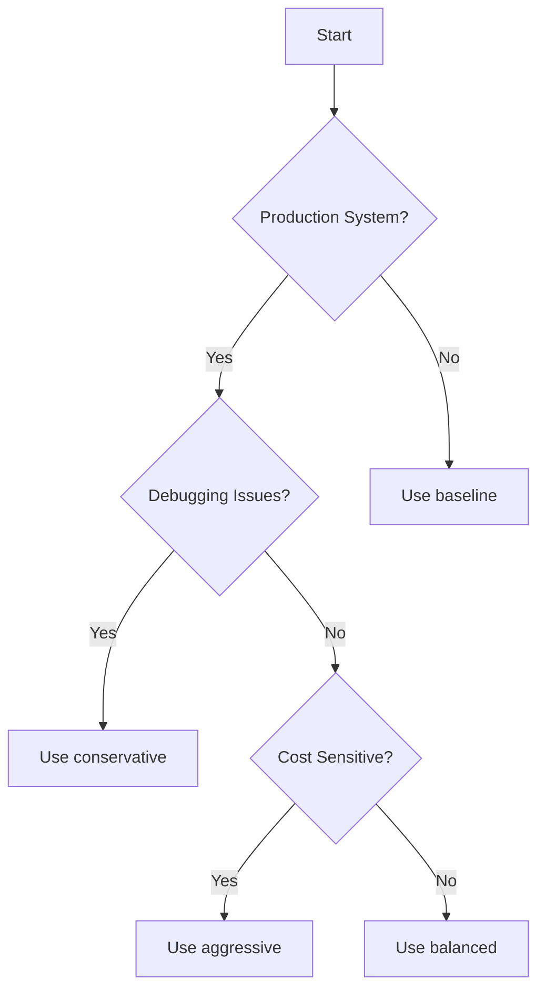

# DashBuilder Deployment Guide

**Production-ready deployment guide for DashBuilder with NRDOT v2 telemetry optimization**

## 📋 Prerequisites

### System Requirements
- **Docker**: v20.10+ with Docker Compose v2.0+
- **Resources**: 4GB RAM minimum, 8GB recommended
- **Storage**: 20GB available disk space
- **OS**: Linux, macOS, or Windows (WSL2)
- **Network**: Outbound HTTPS (443) to New Relic

### New Relic Requirements
- Active New Relic account
- Administrator or Manager role
- API keys with appropriate permissions:
  - 🔑 **License Key**: Ingest metrics
  - 👤 **User API Key**: NerdGraph access
  - 🔍 **Query Key**: NRQL queries
  - 🆔 **Account ID**: Your numeric account ID

### Environment Configuration
```bash
# Required - Get these from New Relic UI
NEW_RELIC_ACCOUNT_ID=your_account_id        # e.g., 3630072
NEW_RELIC_LICENSE_KEY=your_license_key      # 40 character hex
NEW_RELIC_USER_API_KEY=your_user_api_key    # NRAK-XXXXXXXXX
NEW_RELIC_QUERY_KEY=your_query_key          # NRIQ-XXXXXXXXX

# Optional - Defaults shown
NEW_RELIC_REGION=US                         # US or EU
OPTIMIZATION_PROFILE=balanced               # baseline|conservative|balanced|aggressive
CONTROL_LOOP_INTERVAL=300000                # 5 minutes in ms
TARGET_COST_REDUCTION=0.70                  # 70% reduction target
CRITICAL_PROCESS_THRESHOLD=0.95             # 95% coverage minimum
LOG_LEVEL=info                              # debug|info|warn|error
```

## 🚀 Deployment Methods

### 1. Docker Compose (Recommended for Most Users)

**Step-by-Step Deployment**
```bash
# 1. Clone repository
git clone https://github.com/your-org/dashbuilder.git
cd dashbuilder

# 2. Configure environment
cp .env.example .env
# Edit .env with your New Relic credentials

# 3. Validate configuration
npm install
npm run test:connection

# 4. Start services
docker-compose up -d

# 5. Verify deployment
npm run diagnostics:all

# 6. Deploy dashboard
npm run cli dashboard create dashboards/nrdot-main.json
```

**Service Architecture**:
```yaml
services:
  postgres:         # 🗄️ State persistence
    port: 5432
    volume: postgres-data
    
  redis:            # 🔴 Caching & state
    port: 6379
    volume: redis-data
    
  otel-collector:   # 📡 NRDOT telemetry
    ports: 4317, 8889, 13133
    config: configs/collector-nrdot.yaml
    
  control-loop:     # 🤖 Optimization engine
    depends_on: [redis, postgres]
    
  dashbuilder:      # 🌐 API & orchestration
    port: 3000
    depends_on: [postgres, redis]
```

**Health Monitoring**:
```bash
# Check all services
docker-compose ps

# View logs
docker-compose logs -f

# Monitor specific service
docker-compose logs -f control-loop
```

### 2. Kubernetes Deployment (Production Scale)

**Prerequisites**:
- Kubernetes cluster (1.19+)
- kubectl configured
- 2+ nodes with 4GB RAM each

**Using Kustomize (Recommended)**
```bash
# 1. Clone repository
git clone https://github.com/your-org/dashbuilder.git
cd dashbuilder/k8s

# 2. Create secrets
kubectl create namespace dashbuilder

kubectl create secret generic newrelic-keys \
  --namespace=dashbuilder \
  --from-literal=license-key="${NEW_RELIC_LICENSE_KEY}" \
  --from-literal=user-api-key="${NEW_RELIC_USER_API_KEY}" \
  --from-literal=query-key="${NEW_RELIC_QUERY_KEY}" \
  --from-literal=account-id="${NEW_RELIC_ACCOUNT_ID}"

# 3. Configure deployment
cp kustomization.yaml.example kustomization.yaml
# Edit kustomization.yaml with your settings

# 4. Deploy
kubectl apply -k .

# 5. Verify deployment
kubectl get all -n dashbuilder
kubectl logs -n dashbuilder -l app=control-loop
```

**Production Configuration**:
```yaml
# kustomization.yaml
apiVersion: kustomize.config.k8s.io/v1beta1
kind: Kustomization

namespace: dashbuilder

resources:
  - namespace.yaml
  - configmap.yaml
  - deployment.yaml
  - service.yaml
  - hpa.yaml
  - ingress.yaml
  - redis.yaml

configMapGenerator:
  - name: dashbuilder-config
    literals:
      - OPTIMIZATION_PROFILE=balanced
      - CONTROL_LOOP_INTERVAL=300000
      - TARGET_COST_REDUCTION=0.70
      - LOG_LEVEL=info

images:
  - name: dashbuilder
    newTag: latest

replicas:
  - name: otel-collector
    count: 3
  - name: control-loop
    count: 2
```

**Monitoring & Scaling**:
```bash
# View HPA status
kubectl get hpa -n dashbuilder

# Scale manually if needed
kubectl scale deployment/otel-collector -n dashbuilder --replicas=5

# View resource usage
kubectl top pods -n dashbuilder
```

### 3. Cloud Platform Deployments

#### AWS ECS
```bash
# 1. Build and push image
aws ecr get-login-password --region us-east-1 | docker login --username AWS --password-stdin $ECR_REGISTRY
docker build -t dashbuilder .
docker tag dashbuilder:latest $ECR_REGISTRY/dashbuilder:latest
docker push $ECR_REGISTRY/dashbuilder:latest

# 2. Create task definition
aws ecs register-task-definition --cli-input-json file://ecs-task-definition.json

# 3. Create service
aws ecs create-service \
  --cluster production \
  --service-name dashbuilder \
  --task-definition dashbuilder:1 \
  --desired-count 2
```

#### Google Cloud Run
```bash
# 1. Build and deploy
gcloud builds submit --tag gcr.io/$PROJECT_ID/dashbuilder

gcloud run deploy dashbuilder \
  --image gcr.io/$PROJECT_ID/dashbuilder \
  --platform managed \
  --region us-central1 \
  --set-env-vars="NEW_RELIC_LICENSE_KEY=$NEW_RELIC_LICENSE_KEY" \
  --set-env-vars="OPTIMIZATION_PROFILE=balanced"
```

#### Azure Container Instances
```bash
# 1. Create resource group
az group create --name dashbuilder-rg --location eastus

# 2. Create container
az container create \
  --resource-group dashbuilder-rg \
  --name dashbuilder \
  --image dashbuilder:latest \
  --dns-name-label dashbuilder \
  --ports 3000 \
  --environment-variables \
    NEW_RELIC_LICENSE_KEY=$NEW_RELIC_LICENSE_KEY \
    OPTIMIZATION_PROFILE=balanced
```

### 4. Standalone Binary Installation

**For environments without Docker**:
```bash
# 1. Download latest release
curl -L https://github.com/your-org/dashbuilder/releases/latest/download/dashbuilder-linux-amd64 -o dashbuilder
chmod +x dashbuilder

# 2. Create config file
cat > /etc/dashbuilder/config.yaml <<EOF
newrelic:
  licenseKey: ${NEW_RELIC_LICENSE_KEY}
  accountId: ${NEW_RELIC_ACCOUNT_ID}
  region: US

nrdot:
  profile: balanced
  interval: 30s
EOF

# 3. Install as systemd service
sudo mv dashbuilder /usr/local/bin/
sudo cp distributions/nrdot-plus/systemd/nrdot-plus.service /etc/systemd/system/
sudo systemctl enable nrdot-plus
sudo systemctl start nrdot-plus
```

## 🔧 Configuration Profiles

### Profile Comparison

| Profile | Coverage | Cost Reduction | CPU Overhead | Memory Usage | Collection Interval |
|---------|----------|----------------|--------------|--------------|---------------------|
| **baseline** | 100% | 0% | High | 500MB | 10s |
| **conservative** | 95% | 30% | Medium | 300MB | 30s |
| **balanced** | 90% | 60% | Low | 200MB | 30s |
| **aggressive** | 80% | 85% | Minimal | 100MB | 60s |

### Choosing the Right Profile



### Dynamic Profile Management

**Automatic Switching Logic**:
```javascript
// Control loop decision tree
if (currentCost > targetCost * 1.2) {
  switchProfile('aggressive');
} else if (coverage < criticalThreshold) {
  switchProfile('conservative');
} else if (anomalyDetected) {
  switchProfile('baseline');
} else {
  maintainProfile('balanced');
}
```

**Configuration Options**:
```bash
# Enable automatic optimization
CONTROL_LOOP_ENABLED=true
CONTROL_LOOP_INTERVAL=300000        # Check every 5 minutes

# Cost thresholds
TARGET_COST_REDUCTION=0.70          # Aim for 70% reduction
COST_THRESHOLD_CRITICAL=150         # $/hour - switch to aggressive
COST_THRESHOLD_WARNING=100          # $/hour - consider optimization

# Coverage thresholds  
CRITICAL_PROCESS_THRESHOLD=0.95     # Maintain 95% minimum
COVERAGE_THRESHOLD_WARNING=0.90     # Alert if below 90%

# Time-based rules
BUSINESS_HOURS_PROFILE=conservative # 9am-5pm
OFF_HOURS_PROFILE=aggressive        # 5pm-9am
WEEKEND_PROFILE=aggressive          # Sat-Sun
```

## 📊 Monitoring & Validation

### Post-Deployment Checklist

```bash
# 1. Verify all services are healthy
npm run diagnostics:all

# Expected output:
# ✅ PostgreSQL: Connected
# ✅ Redis: Connected  
# ✅ OTEL Collector: Healthy
# ✅ Control Loop: Active
# ✅ New Relic API: Connected

# 2. Check metrics are flowing
npm run test:metrics

# 3. Verify dashboards are accessible
npm run cli dashboard list

# 4. Run quick experiment
npm run experiment:quick
```

### Dashboard Deployment

**Deploy Standard Dashboards**:
```bash
# Main monitoring dashboard
npm run cli dashboard create dashboards/nrdot-main.json

# KPI tracking dashboard
npm run cli dashboard create dashboards/kpi-dashboard.json

# Experiment results dashboard
npm run cli dashboard create dashboards/experiment-dashboard.json

# Day 1 operations dashboard
npm run cli dashboard create dashboards/day1-monitoring.json
```

**Custom Dashboard Creation**:
```bash
# Interactive dashboard builder
npm run cli dashboard create --interactive

# From template
npm run cli dashboard create --template cost-analysis

# With specific metrics
npm run cli dashboard create \
  --name "My Custom Dashboard" \
  --metrics "ProcessSample,SystemSample" \
  --timerange "1 hour"
```

### Monitoring Endpoints

| Service | Endpoint | Purpose |
|---------|----------|---------|
| Collector Health | http://localhost:13133/health | Service status |
| Collector Metrics | http://localhost:8889/metrics | Prometheus metrics |
| API Health | http://localhost:3000/health | API status |
| WebSocket | ws://localhost:3000/ws | Real-time updates |

## 🔒 Security Best Practices

### Secrets Management

**Development**:
```bash
# Use .env file (gitignored)
cp .env.example .env
chmod 600 .env

# Never commit secrets
echo ".env" >> .gitignore
```

**Production**:
```bash
# Use environment-specific secret managers

# AWS Secrets Manager
aws secretsmanager create-secret \
  --name dashbuilder/production \
  --secret-string file://.env

# Kubernetes Secrets
kubectl create secret generic dashbuilder-secrets \
  --from-env-file=.env \
  --namespace=dashbuilder

# HashiCorp Vault
vault kv put secret/dashbuilder @.env
```

### Network Security

**Firewall Rules**:
```bash
# Required outbound
- 443/tcp to *.newrelic.com     # API access
- 443/tcp to otlp.nr-data.net   # Metrics

# Required inbound (internal only)
- 4317/tcp  # OTLP gRPC
- 4318/tcp  # OTLP HTTP
- 8889/tcp  # Prometheus metrics
- 13133/tcp # Health checks
```

**TLS Configuration**:
```yaml
# Enable TLS for all endpoints
tls:
  enabled: true
  certFile: /etc/ssl/certs/dashbuilder.crt
  keyFile: /etc/ssl/private/dashbuilder.key
  minVersion: "1.2"
  cipherSuites:
    - TLS_ECDHE_RSA_WITH_AES_128_GCM_SHA256
    - TLS_ECDHE_RSA_WITH_AES_256_GCM_SHA384
```

### Access Control

**New Relic RBAC Setup**:
```bash
# Create restricted API key
# Admin Console → API Keys → Create Key
# Permissions:
#   - Query NRDB (Read)
#   - Manage Dashboards (Write)
#   - View Entities (Read)

# Audit logging
NEW_RELIC_AUDIT_ENABLED=true
NEW_RELIC_AUDIT_RETENTION_DAYS=90
```

**Container Security**:
```dockerfile
# Run as non-root user
USER 1001:1001

# Read-only root filesystem
SecurityContext:
  runAsNonRoot: true
  readOnlyRootFilesystem: true
  allowPrivilegeEscalation: false
```

## 🚨 Troubleshooting Guide

### Common Issues & Solutions

#### 1. No Metrics in New Relic

**Diagnosis**:
```bash
# Step 1: Check collector is receiving data
docker exec nrdot-collector curl -s http://localhost:8889/metrics | grep "receiver_accepted_metric_points"
# Should show increasing numbers

# Step 2: Check exporter is sending data
docker exec nrdot-collector curl -s http://localhost:8889/metrics | grep "exporter_sent_metric_points"
# Should show increasing numbers

# Step 3: Check for errors
docker logs nrdot-collector 2>&1 | grep -i error | tail -20
```

**Solutions**:
```bash
# Fix: Authentication issues
echo $NEW_RELIC_LICENSE_KEY | wc -c  # Should be 41 (40 chars + newline)

# Fix: Wrong endpoint
export NEW_RELIC_REGION=EU  # If using EU datacenter

# Fix: Network issues
docker exec nrdot-collector wget -O- https://otlp.nr-data.net
```

#### 2. High Resource Usage

**Diagnosis**:
```bash
# Check current resource usage
docker stats --no-stream

# Check current profile
docker exec control-loop redis-cli GET current_profile

# View process count
docker exec nrdot-collector curl -s http://localhost:8889/metrics | grep "process_count"
```

**Solutions**:
```bash
# Switch to aggressive profile immediately
docker exec control-loop redis-cli SET current_profile aggressive
docker-compose restart otel-collector

# Increase filtering
export PROCESS_IMPORTANCE_THRESHOLD=0.9
export MAX_PROCESSES_PER_HOST=30
docker-compose up -d
```

#### 3. Control Loop Not Working

**Diagnosis**:
```bash
# Check control loop logs
docker logs control-loop --tail 50

# Verify Redis connection
docker exec control-loop redis-cli ping

# Check decision history
docker exec control-loop redis-cli LRANGE optimization_decisions 0 10
```

**Solutions**:
```bash
# Restart control loop
docker-compose restart control-loop

# Reset state
docker exec control-loop redis-cli FLUSHDB

# Manual profile override
npm run control-loop:override balanced
```

#### 4. Dashboard Deployment Failures

**Diagnosis**:
```bash
# Test API connectivity
npm run test:connection -- --verbose

# Validate dashboard JSON
npm run cli dashboard validate dashboards/nrdot-main.json

# Check API permissions
npm run test:nerdgraph
```

**Solutions**:
```bash
# Fix: Missing User API Key
export NEW_RELIC_USER_API_KEY="NRAK-YOUR-KEY-HERE"

# Fix: Invalid dashboard
npm run cli dashboard fix dashboards/nrdot-main.json

# Fix: Rate limiting
npm run cli dashboard create --retry 3 --delay 5000
```

### Emergency Procedures

**System Overload**:
```bash
# Emergency stop all optimization
docker-compose stop control-loop
docker exec otel-collector rm -f /etc/otel/config.yaml
docker-compose restart otel-collector
```

**Data Loss Prevention**:
```bash
# Backup current state
docker exec postgres pg_dump -U dashbuilder > backup.sql
docker exec redis redis-cli SAVE

# Restore if needed
cat backup.sql | docker exec -i postgres psql -U dashbuilder
```

## 📈 Production Best Practices

### Pre-Production Checklist

- [ ] Run experiments in staging environment
- [ ] Document baseline metrics (cost, coverage)
- [ ] Set up alerting policies
- [ ] Create runbooks for common issues
- [ ] Train operations team
- [ ] Plan rollback procedure

### Deployment Strategy

**Week 1: Conservative Start**
```bash
# Start with maximum visibility
export OPTIMIZATION_PROFILE=conservative
export CONTROL_LOOP_ENABLED=false  # Manual control initially
```

**Week 2: Enable Automation**
```bash
# Enable control loop with tight bounds
export CONTROL_LOOP_ENABLED=true
export COVERAGE_THRESHOLD_LOW=0.93  # Alert if < 93%
export COST_THRESHOLD_HIGH=120     # Alert if > $120/hour
```

**Week 3: Optimize**
```bash
# Move to balanced profile
export OPTIMIZATION_PROFILE=balanced
export TARGET_COST_REDUCTION=0.60   # 60% reduction target
```

**Week 4: Full Automation**
```bash
# Enable all features
export ANOMALY_DETECTION_ENABLED=true
export AUTO_PROFILE_SWITCHING=true
export BUSINESS_HOURS_AWARE=true
```

### Monitoring & Alerting

**Critical Alerts**:
```yaml
- name: Process Coverage Drop
  condition: coverage < 85%
  action: Switch to conservative profile
  
- name: Cost Spike
  condition: hourly_cost > $150
  action: Switch to aggressive profile
  
- name: Collector Down
  condition: healthcheck failing
  action: Page on-call engineer
```

**Regular Reviews**:
- **Daily**: Check dashboard for anomalies
- **Weekly**: Review cost/coverage trends
- **Monthly**: Analyze optimization effectiveness
- **Quarterly**: Update profiles based on learnings

## 🔄 Maintenance & Updates

### Update Procedures

**Docker Compose Update**:
```bash
# 1. Backup current state
npm run backup:create

# 2. Pull latest images
docker-compose pull

# 3. Update with zero downtime
docker-compose up -d --no-deps --scale otel-collector=2 otel-collector
docker-compose up -d

# 4. Verify update
npm run diagnostics:all
npm run test:metrics

# 5. Remove old containers
docker system prune -f
```

**Kubernetes Rolling Update**:
```bash
# 1. Update image tag
kubectl set image deployment/otel-collector \
  otel-collector=dashbuilder:v2.0.0 \
  -n dashbuilder

# 2. Monitor rollout
kubectl rollout status deployment/otel-collector -n dashbuilder

# 3. Verify pods
kubectl get pods -n dashbuilder
kubectl logs -n dashbuilder -l app=otel-collector --tail=50
```

### Backup & Recovery

**Automated Backups**:
```bash
# Enable automated backups
export BACKUP_ENABLED=true
export BACKUP_RETENTION_DAYS=30
export BACKUP_SCHEDULE="0 2 * * *"  # 2 AM daily

# Manual backup
npm run backup:create

# List backups
npm run backup:list

# Restore from backup
npm run backup:restore --date 2024-01-15
```

### Version Management

```bash
# Check current versions
npm run version:check

# Update to specific version
npm run update --version v1.2.3

# Rollback if needed
npm run rollback --to-version v1.2.2
```

## 📚 Additional Resources

### Documentation
- 🏗️ [Architecture Overview](./architecture.md) - System design and components
- 🔥 [Troubleshooting Runbook](./TROUBLESHOOTING_RUNBOOK.md) - Common issues and solutions
- 🧪 [Experiment Guide](./EXPERIMENT_TRACKING_GUIDE.md) - Running optimization experiments
- 🏭 [Production Setup](./production-setup.md) - Enterprise deployment guide
- 📖 [API Reference](./api-reference.md) - REST API documentation

### Tools & Utilities
```bash
# Interactive setup wizard
npm run setup

# CLI for all operations
npm run cli help

# Diagnostic tools
npm run doctor           # System health check
npm run debug:collector  # Collector debugging
npm run analyze:costs    # Cost analysis
```

### Community & Support
- 💬 [GitHub Discussions](https://github.com/your-org/dashbuilder/discussions)
- 🐛 [Issue Tracker](https://github.com/your-org/dashbuilder/issues)
- 📧 [Email Support](mailto:support@dashbuilder.io)
- 📺 [Video Tutorials](https://youtube.com/dashbuilder)

### Quick Reference Card
```bash
# Most used commands
npm run test:connection  # Test New Relic connectivity
npm run diagnostics:all  # Full system check
npm run experiment:quick # Run 5-min experiment
npm run cli             # Interactive CLI
npm run monitor         # Real-time monitoring
npm run backup:create   # Create backup
npm run help           # Show all commands
```

---

**Pro Tip**: Star the repository to stay updated with new features! ⭐