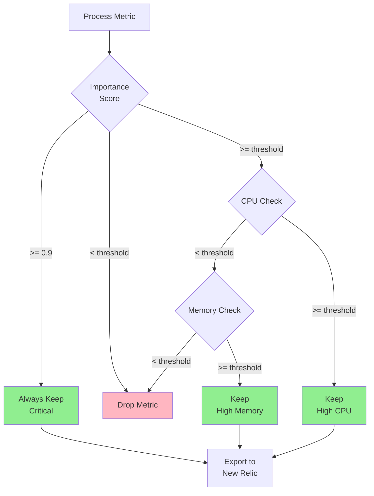

# NRDOT v2 Complete System Flow

## High-Level Architecture


## Detailed Process Flow


## Data Transformations


## Profile-Based Filtering Logic



## Control Loop State Machine


## Cost Model

```
Hourly Cost = Series Count × 60 × $0.25/million

Where:
- Series Count = Number of unique process metric streams
- 60 = Datapoints per hour (1 per minute)
- $0.25 = Cost per million datapoints

Example:
- 5,000 series × 60 × $0.25/1,000,000 = $0.075/hour
- Monthly: $0.075 × 24 × 30 = $54/month
```