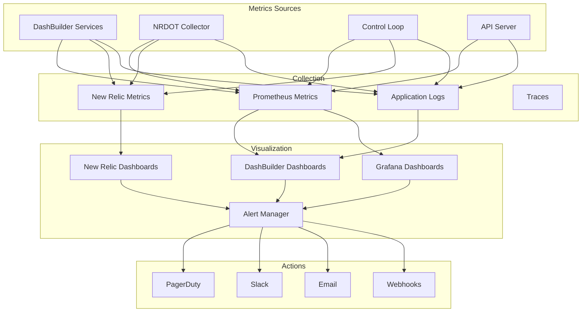

# DashBuilder Monitoring & Alerting Guide

**Comprehensive guide for monitoring DashBuilder platform health and NRDOT optimization effectiveness**

## Table of Contents

1. [Overview](#overview)
2. [Key Performance Indicators](#key-performance-indicators)
3. [Platform Health Monitoring](#platform-health-monitoring)
4. [NRDOT Optimization Monitoring](#nrdot-optimization-monitoring)
5. [Setting Up Alerts](#setting-up-alerts)
6. [Operational Dashboards](#operational-dashboards)
7. [Integration with Monitoring Tools](#integration-with-monitoring-tools)
8. [Troubleshooting Metrics](#troubleshooting-metrics)
9. [Best Practices](#best-practices)
10. [Alert Runbooks](#alert-runbooks)

## Overview

Effective monitoring is crucial for maintaining DashBuilder platform health and ensuring NRDOT optimization delivers expected cost savings. This guide provides comprehensive monitoring strategies for production deployments.

### Monitoring Architecture



## Key Performance Indicators

### Business KPIs

| Metric | Description | Target | Alert Threshold |
|--------|-------------|--------|-----------------|
| **Cost Reduction %** | Percentage reduction in telemetry costs | 70-85% | < 50% |
| **Process Coverage %** | Percentage of critical processes monitored | > 95% | < 90% |
| **Dashboard Availability** | Uptime of monitoring dashboards | 99.9% | < 99.5% |
| **Optimization Effectiveness** | Ratio of actual vs expected savings | > 0.9 | < 0.8 |
| **Time to Detection** | Time to detect anomalies | < 5 min | > 10 min |

### Technical KPIs

| Metric | Description | Target | Alert Threshold |
|--------|-------------|--------|-----------------|
| **API Response Time** | p95 latency for API calls | < 100ms | > 500ms |
| **Collector Throughput** | Events processed per second | > 50K | < 30K |
| **Control Loop Cycle Time** | Time for optimization decision | < 60s | > 180s |
| **Error Rate** | Percentage of failed operations | < 0.1% | > 1% |
| **Queue Depth** | Pending operations in queue | < 1000 | > 5000 |

## Platform Health Monitoring

### Service Health Checks

```yaml
# docker-compose health monitoring
healthchecks:
  otel-collector:
    endpoint: http://localhost:13133/health
    interval: 30s
    critical: true
    
  control-loop:
    endpoint: http://localhost:8080/health
    interval: 30s
    critical: true
    
  api-server:
    endpoint: http://localhost:3000/health
    interval: 10s
    critical: true
    
  postgres:
    command: pg_isready -U dashbuilder
    interval: 30s
    critical: true
    
  redis:
    command: redis-cli ping
    interval: 10s
    critical: true
```

### Prometheus Metrics

**Key Metrics to Monitor:**

```promql
# Service uptime
up{service="dashbuilder"} == 1

# API latency percentiles
histogram_quantile(0.95, 
  rate(http_request_duration_seconds_bucket[5m])
)

# Error rates
rate(http_requests_total{status=~"5.."}[5m]) / 
rate(http_requests_total[5m])

# Resource utilization
container_memory_usage_bytes{name="nrdot-collector"} / 
container_spec_memory_limit_bytes{name="nrdot-collector"}

# Queue depth
dashbuilder_queue_depth{queue="optimization"}
```

### Log Monitoring

**Critical Log Patterns:**

```bash
# Error patterns to monitor
ERROR|FATAL|PANIC|Exception|Failed|Timeout|Refused

# Warning patterns
WARN|WARNING|Degraded|Slow|High

# Success patterns
SUCCESS|Completed|Optimized|Saved
```

**Log Aggregation Query:**

```sql
-- New Relic Logs
SELECT count(*) 
FROM Log 
WHERE service_name IN ('dashbuilder', 'nrdot-collector', 'control-loop')
  AND severity = 'ERROR'
FACET message
SINCE 1 hour ago
```

## NRDOT Optimization Monitoring

### Cost Metrics

```sql
-- Hourly cost trend
SELECT average(nrdot_estimated_cost_per_hour) as 'Cost/Hour',
       average(nrdot_datapoints_per_hour) as 'Datapoints/Hour',
       average(nrdot_estimated_cost_per_hour) * 24 * 30 as 'Monthly Cost'
FROM Metric
WHERE service.name = 'nrdot-collector'
SINCE 24 hours ago
TIMESERIES 1 hour
```

### Coverage Metrics

```sql
-- Process coverage by profile
SELECT latest(nrdot_process_coverage_percentage) as 'Coverage %',
       latest(nrdot_process_series_kept) as 'Processes Kept',
       latest(nrdot_process_series_total) as 'Total Processes'
FROM Metric
WHERE service.name = 'nrdot-collector'
FACET nrdot_profile
SINCE 1 hour ago
```

### Profile Performance

```sql
-- Profile effectiveness
SELECT latest(nrdot_profile) as 'Current Profile',
       average(nrdot_cost_reduction_percentage) as 'Cost Reduction %',
       average(nrdot_process_coverage_percentage) as 'Coverage %',
       count(nrdot_profile_switch_count) as 'Profile Switches'
FROM Metric
WHERE service.name = 'nrdot-collector'
SINCE 24 hours ago
```

### Anomaly Detection

```sql
-- Anomaly score monitoring
SELECT average(nrdot_anomaly_score) as 'Anomaly Score',
       max(nrdot_anomaly_score) as 'Max Score',
       count(*) as 'Anomalies Detected'
FROM Metric
WHERE service.name = 'nrdot-collector'
  AND nrdot_anomaly_score > 0.8
SINCE 1 hour ago
TIMESERIES 5 minutes
```

## Setting Up Alerts

### Critical Alerts

**1. Cost Overrun Alert**

```yaml
name: High Telemetry Cost
condition:
  query: |
    SELECT average(nrdot_estimated_cost_per_hour)
    FROM Metric
    WHERE service.name = 'nrdot-collector'
  threshold: 
    critical: 150  # 150% of target
    warning: 120   # 120% of target
  duration: 5 minutes
actions:
  - pagerduty: oncall-team
  - slack: #alerts-critical
  - email: ops@company.com
```

**2. Low Coverage Alert**

```yaml
name: Process Coverage Drop
condition:
  query: |
    SELECT latest(nrdot_process_coverage_percentage)
    FROM Metric
    WHERE service.name = 'nrdot-collector'
  threshold:
    critical: < 85
    warning: < 90
  duration: 10 minutes
actions:
  - slack: #monitoring
  - dashboard: open-coverage-dashboard
```

**3. Service Down Alert**

```yaml
name: DashBuilder Service Down
condition:
  query: |
    SELECT count(*)
    FROM SystemSample
    WHERE processDisplayName LIKE '%dashbuilder%'
  threshold:
    critical: 0
  duration: 2 minutes
actions:
  - pagerduty: immediate
  - phone: oncall
```

### Warning Alerts

**1. High Memory Usage**

```yaml
name: High Memory Utilization
condition:
  query: |
    SELECT average(memoryUsedPercent)
    FROM SystemSample
    WHERE hostname LIKE '%dashbuilder%'
  threshold:
    warning: > 80
    critical: > 90
  duration: 5 minutes
```

**2. API Latency**

```yaml
name: API Response Slow
condition:
  query: |
    SELECT percentile(duration, 95)
    FROM Transaction
    WHERE appName = 'dashbuilder-api'
  threshold:
    warning: > 500  # ms
    critical: > 1000
  duration: 5 minutes
```

### Informational Alerts

**1. Profile Switch**

```yaml
name: Optimization Profile Changed
condition:
  query: |
    SELECT count(*)
    FROM Log
    WHERE message LIKE '%Profile switched%'
  threshold: > 0
  duration: 1 minute
actions:
  - slack: #monitoring-info
  - log: audit-trail
```

## Operational Dashboards

### Main Operations Dashboard

```json
{
  "name": "DashBuilder Operations",
  "pages": [{
    "name": "Overview",
    "widgets": [
      {
        "title": "Platform Health Score",
        "type": "billboard",
        "query": "SELECT average(health_score) FROM Metric WHERE service.name LIKE '%dashbuilder%'",
        "thresholds": {
          "critical": 80,
          "warning": 90
        }
      },
      {
        "title": "Cost Savings",
        "type": "line",
        "query": "SELECT average(nrdot_cost_reduction_percentage) FROM Metric TIMESERIES"
      },
      {
        "title": "Service Status",
        "type": "table",
        "query": "SELECT latest(up) FROM Metric FACET service_name"
      },
      {
        "title": "Error Rate",
        "type": "area",
        "query": "SELECT rate(count(*), 1 minute) FROM Log WHERE severity = 'ERROR' TIMESERIES"
      }
    ]
  }]
}
```

### Cost Optimization Dashboard

```json
{
  "name": "NRDOT Cost Optimization",
  "variables": [{
    "name": "profile",
    "type": "enum",
    "values": ["baseline", "conservative", "balanced", "aggressive"]
  }],
  "widgets": [
    {
      "title": "Hourly Cost Trend",
      "query": "SELECT average(nrdot_estimated_cost_per_hour) FROM Metric WHERE nrdot_profile = {{profile}} TIMESERIES"
    },
    {
      "title": "Cost by Profile",
      "query": "SELECT average(nrdot_estimated_cost_per_hour) FROM Metric FACET nrdot_profile"
    },
    {
      "title": "Savings Calculator",
      "query": "SELECT (1 - average(nrdot_estimated_cost_per_hour) / 100) * 100 as 'Savings %' FROM Metric"
    }
  ]
}
```

### Performance Dashboard

```json
{
  "name": "DashBuilder Performance",
  "widgets": [
    {
      "title": "API Response Times",
      "query": "SELECT percentile(duration, 50, 95, 99) FROM Transaction WHERE appName = 'dashbuilder-api' TIMESERIES"
    },
    {
      "title": "Throughput",
      "query": "SELECT rate(count(*), 1 minute) FROM Transaction FACET name TIMESERIES"
    },
    {
      "title": "Resource Usage",
      "query": "SELECT average(cpuPercent), average(memoryUsedPercent) FROM SystemSample WHERE hostname LIKE '%dashbuilder%' TIMESERIES"
    }
  ]
}
```

## Integration with Monitoring Tools

### Grafana Integration

```yaml
# Prometheus data source
apiVersion: 1
datasources:
  - name: DashBuilder-Prometheus
    type: prometheus
    url: http://prometheus:9090
    access: proxy
    isDefault: true
    
  - name: New-Relic
    type: newrelic
    url: https://insights-api.newrelic.com
    jsonData:
      accountId: ${NEW_RELIC_ACCOUNT_ID}
    secureJsonData:
      queryKey: ${NEW_RELIC_QUERY_KEY}
```

### Datadog Integration

```yaml
# datadog-agent.yaml
api_key: ${DATADOG_API_KEY}
logs_enabled: true
apm_enabled: true

integrations:
  - name: docker
    instances:
      - url: unix://var/run/docker.sock
        labels:
          - "service:dashbuilder"
          
  - name: postgres
    instances:
      - host: postgres
        port: 5432
        username: datadog
        dbname: dashbuilder
```

### PagerDuty Integration

```javascript
// Alert webhook handler
app.post('/webhook/pagerduty', async (req, res) => {
  const alert = req.body;
  
  if (alert.severity === 'CRITICAL') {
    await pagerduty.createIncident({
      title: alert.conditionName,
      description: alert.details,
      urgency: 'high',
      service: 'dashbuilder-prod',
      escalation_policy: 'platform-oncall'
    });
  }
  
  res.status(200).send('OK');
});
```

## Troubleshooting Metrics

### Metric Collection Issues

```bash
# Check metric export
curl -s http://localhost:8889/metrics | grep nrdot

# Verify collector pipeline
docker exec nrdot-collector curl http://localhost:13133/debug/tracez

# Check metric cardinality
docker exec nrdot-collector curl -s http://localhost:8889/metrics | wc -l
```

### Missing Metrics Checklist

1. **Verify Service Running**
   ```bash
   docker-compose ps
   systemctl status dashbuilder
   ```

2. **Check Network Connectivity**
   ```bash
   telnet otlp.nr-data.net 443
   curl -v https://insights-api.newrelic.com/v1/accounts/${ACCOUNT_ID}/query
   ```

3. **Validate Configuration**
   ```bash
   docker exec nrdot-collector cat /etc/otel/config.yaml
   grep -E "api-key|endpoint" configs/*.yaml
   ```

### Performance Issues

```sql
-- Identify slow queries
SELECT average(duration), count(*)
FROM Transaction
WHERE appName = 'dashbuilder-api'
FACET request.uri
WHERE duration > 1
SINCE 1 hour ago
```

## Best Practices

### 1. Alert Design

**DO:**
- Set meaningful thresholds based on baselines
- Include context in alert descriptions
- Define clear escalation paths
- Test alerts regularly

**DON'T:**
- Create alerts for every metric
- Set thresholds too sensitive
- Ignore alert fatigue
- Forget to document response procedures

### 2. Dashboard Organization

```yaml
Dashboard Structure:
  Overview:
    - Health score
    - Key metrics
    - Service status
    
  Deep Dive:
    - Detailed metrics
    - Historical trends
    - Comparative analysis
    
  Troubleshooting:
    - Error logs
    - Performance bottlenecks
    - Resource usage
```

### 3. Metric Retention

```yaml
Retention Policies:
  High-frequency (1m): 7 days
  Medium-frequency (5m): 30 days
  Low-frequency (1h): 90 days
  Daily aggregates: 1 year
```

### 4. Monitoring Automation

```javascript
// Automated health report
async function generateHealthReport() {
  const metrics = await collectHealthMetrics();
  const issues = analyzeMetrics(metrics);
  
  if (issues.length > 0) {
    await sendReport({
      to: 'ops-team@company.com',
      subject: 'DashBuilder Health Report',
      metrics,
      issues,
      recommendations: generateRecommendations(issues)
    });
  }
}

// Schedule daily
cron.schedule('0 9 * * *', generateHealthReport);
```

## Alert Runbooks

### Cost Overrun Response

```markdown
## Alert: High Telemetry Cost

### Immediate Actions:
1. Check current profile: `npm run cli profile current`
2. Switch to aggressive if not already: `npm run cli profile switch aggressive`
3. Verify switch successful: Check dashboard

### Investigation:
1. Query cost breakdown by host
2. Identify top cost contributors
3. Check for configuration drift
4. Review recent changes

### Resolution:
1. Adjust filters if needed
2. Update cost targets
3. Document root cause
```

### Low Coverage Response

```markdown
## Alert: Process Coverage Drop

### Immediate Actions:
1. Switch to conservative profile
2. Check critical processes are monitored
3. Verify no production issues

### Investigation:
1. Compare process lists
2. Check filter configurations
3. Review importance scores
4. Analyze excluded processes

### Resolution:
1. Adjust importance thresholds
2. Update critical process list
3. Fine-tune profiles
```

### Service Down Response

```markdown
## Alert: DashBuilder Service Down

### Immediate Actions:
1. Check service status: `docker-compose ps`
2. Restart if needed: `docker-compose restart <service>`
3. Check logs: `docker-compose logs --tail=100 <service>`

### Investigation:
1. Review error logs
2. Check resource usage
3. Verify dependencies
4. Test connectivity

### Resolution:
1. Fix root cause
2. Restart services
3. Verify functionality
4. Update runbook if needed
```

## Monitoring Checklist

### Daily Checks
- [ ] Platform health score > 95%
- [ ] All services running
- [ ] No critical alerts
- [ ] Cost within budget
- [ ] Coverage > 90%

### Weekly Review
- [ ] Analyze cost trends
- [ ] Review optimization effectiveness
- [ ] Check for anomalies
- [ ] Update dashboards if needed
- [ ] Review alert thresholds

### Monthly Tasks
- [ ] Generate cost report
- [ ] Review and optimize alerts
- [ ] Update monitoring documentation
- [ ] Plan capacity needs
- [ ] Review SLO compliance

## Advanced Monitoring

### Custom Metrics

```javascript
// Add custom business metrics
const customMetrics = {
  dashboardsCreated: new promClient.Counter({
    name: 'dashbuilder_dashboards_created_total',
    help: 'Total dashboards created',
    labelNames: ['template', 'user']
  }),
  
  optimizationSavings: new promClient.Gauge({
    name: 'dashbuilder_optimization_savings_dollars',
    help: 'Estimated savings in dollars',
    labelNames: ['profile', 'account']
  }),
  
  experimentDuration: new promClient.Histogram({
    name: 'dashbuilder_experiment_duration_seconds',
    help: 'Experiment execution time',
    buckets: [60, 300, 600, 1800, 3600]
  })
};
```

### SLI/SLO Definition

```yaml
SLIs:
  - name: API Availability
    query: sum(up{service="dashbuilder-api"}) / count(up{service="dashbuilder-api"})
    
  - name: Cost Reduction
    query: average(nrdot_cost_reduction_percentage)
    
  - name: Process Coverage
    query: average(nrdot_process_coverage_percentage)

SLOs:
  - sli: API Availability
    target: 99.9%
    window: 30d
    
  - sli: Cost Reduction
    target: 70%
    window: 7d
    
  - sli: Process Coverage
    target: 95%
    window: 24h
```

## Resources

- [Prometheus Best Practices](https://prometheus.io/docs/practices/)
- [New Relic Alerting](https://docs.newrelic.com/docs/alerts/)
- [Grafana Dashboard Design](https://grafana.com/docs/grafana/latest/dashboards/)
- [SRE Monitoring Guide](https://sre.google/sre-book/monitoring-distributed-systems/)

---

*Monitoring Guide Version: 1.0 | Last Updated: January 2025*